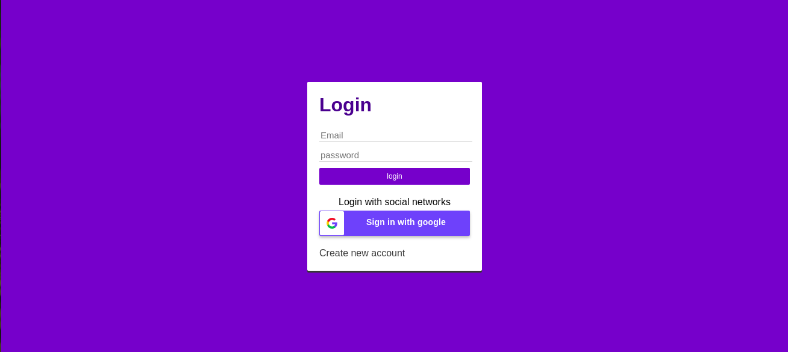
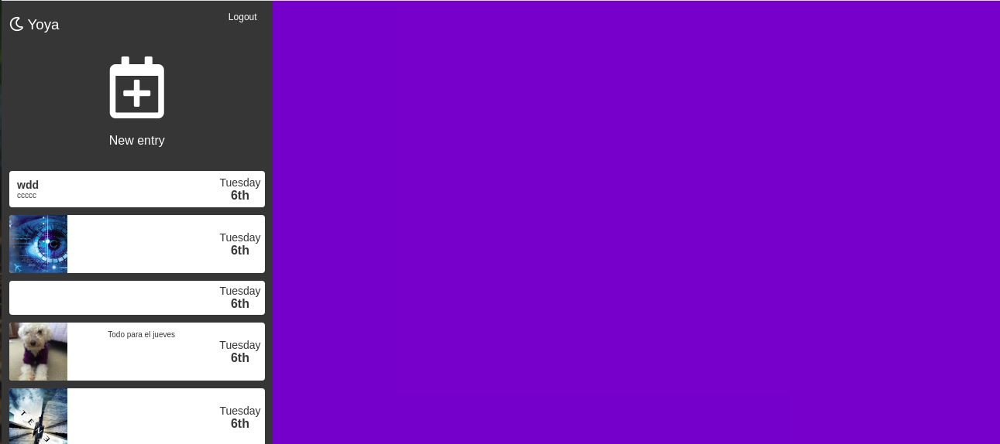
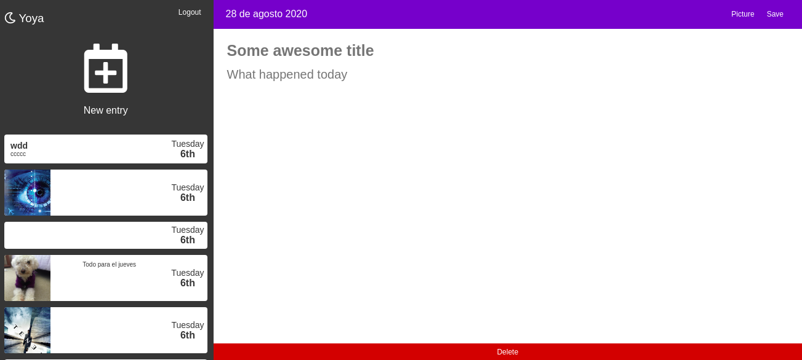

Journal App es una aplicacion que lo ayudara a guardar y escribir sobre lo que va sucediendo en su día a día, construida con React, JavaScript y CSS. Usando React Router para crear rutas privadas y públicas además del uso Hooks y Hooks personalizados y  Redux para manejar el estado de la app.La autenticacion con redux la realizamos mediante Firebase usando tanto autenticación personalizada como Google Sign-in. Usamos FireStore como base de datos donde realizar el CRUD y alojamos las imagnes en cloudinary .Los estilos son trabajados con SASS y Bootstrap y muestra de informaciones con "sweetalert2".Tambien se realizaron Unit and integration tests mediante Jest donde se ocupó Enzyme, React Testing Library y Mocks.La app fue alojada mediante el servicio de AWS Amplify. 

Capturas de pantalla del proyecto

Link para acceder a la app

https://master.d1tzl41yq2ry53.amplifyapp.com/

Instrucciones de instalación y configuración

Clona este repositorio. Necesitará node y npm instalada a nivel global en su máquina.

Instalación:

npm install

Para iniciar el servidor:

npm start

Para visitar la aplicación:

localhost:3000/
